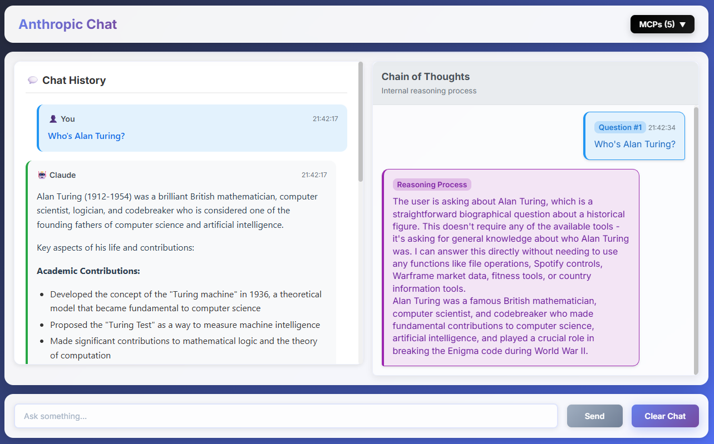

# Claude Client + MCP Integrador Client

A powerful LLM client that integrates Claude with Model Context Protocol (MCP) servers, enabling Claude to interact with external tools through a React frontend and Express backend bridge.

## UI Overview




*The interface features a dual-pane layout with chat history on the left and chain-of-thought reasoning on the right*

## Features

### 🔧 MCP Tool Integration
- **Multiple MCP Servers**: Connects to various MCP servers (Spotify, GitHub, Warframe Market, Personal Trainer, Countries Info)
- **Tool Discovery**: Automatically discovers and loads available tools from connected servers
- **Real-time Tool Execution**: Execute tools with live feedback and results visualization

### 🧠 Chain of Thought System
- **Transparent Reasoning**: See Claude's thinking process in real-time
- **Debugging Support**: Separate display of reasoning (`<thinking>`) and final answers (`<answer>`)
- **Development Mode**: Test mode for development without API calls

### 🎨 Modern Interface
- **Dual-pane Layout**: Chat history and reasoning displayed side by side
- **Real-time Updates**: Live tool execution with MCP request/response data
- **Responsive Design**: Works on desktop and mobile devices

## MCP Documentation

This client supports the [Model Context Protocol](https://github.com/modelcontextprotocol/specification), enabling Claude to:
- Use external APIs and services
- Access real-time data
- Execute complex workflows
- Interact with various data sources

Supported MCP server types:
- **stdio transport**: Direct process communication
- **docker containers**: Containerized MCP servers  
- **remote servers**: HTTP-based MCP servers

## Quick Start

### 1. Clone the Repository
```bash
git clone https://github.com/your-username/mcp-llm-client.git
cd mcp-llm-client
```

### 2. Environment Setup

Create `.env` file in the root directory:
```env
VITE_ANTHROPIC_API_KEY=your_anthropic_api_key_here
VITE_BACKEND_URL=http://localhost:3001
```

Create `.env` file in the backend directory:
```env
GITHUB_PERSONAL_ACCESS_TOKEN=your_github_token_here
PORT=3001
```

### 3. Install Dependencies

**Frontend:**
```bash
npm install
```

**Backend:**
```bash
cd backend
npm install
```

### 4. Start the Application

**Terminal 1 - Start Backend Bridge:**
```bash
cd backend
npm start
```

**Terminal 2 - Start Frontend Client:**
```bash
npm start
```

The application will be available at `http://localhost:5173`

## Usage

1. **Start Both Services**: Ensure both backend (port 3001) and frontend (port 5173) are running
2. **Configure API Key**: Add your Anthropic API key to the `.env` file
3. **Select Mode**: Choose between "Test Mode" (for development) or "Real Mode" (with API calls)
4. **Chat with Claude**: Ask questions and watch Claude use MCP tools in real-time
5. **Monitor Chain of Thought**: View Claude's reasoning process in the right pane

## Development

### Project Structure
```
├── src/                    # Frontend React application
│   ├── components/         # React components
│   ├── lib/               # Anthropic SDK integration
│   └── App.tsx            # Main chat interface
├── backend/               # Express backend
│   ├── src/
│   │   ├── server.ts      # Express server
│   │   ├── mcpBridge.ts   # MCP client management
│   │   └── mcpRegistry.ts # MCP server configuration
└── README.md
```

### Available Scripts

**Frontend:**
- `npm run dev` - Start development server
- `npm run build` - Build for production
- `npm run lint` - Run linting
- `npm run preview` - Preview production build

**Backend:**
- `npm start` - Start development server (uses tsx for TypeScript)

## Configuration

### MCP Servers
Configure MCP servers in `backend/src/mcpRegistry.ts`. Currently includes:
- Spotify MCP (Python script)
- GitHub MCP (Docker container) 
- Warframe Market MCP (Node.js)
- Personal Trainer MCP (Python script)
- Countries Info MCP (Remote server)

### Environment Variables
- `VITE_ANTHROPIC_API_KEY`: Your Anthropic API key for Claude access
- `VITE_BACKEND_URL`: Backend server URL (default: http://localhost:3001)
- `GITHUB_PERSONAL_ACCESS_TOKEN`: GitHub token for GitHub MCP server
- `PORT`: Backend server port (default: 3001)

## Contributing

1. Fork the repository
2. Create a feature branch
3. Make your changes
4. Test thoroughly
5. Submit a pull request

## License

This project is licensed under the MIT License - see the LICENSE file for details.